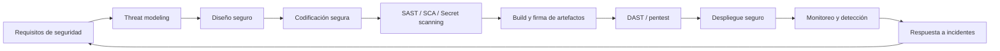
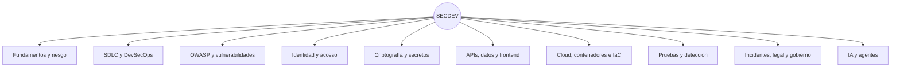

# Grafo de SECDEV

Pega estos bloques en Obsidian con Mermaid activado (o usa la vista de grafo nativa).

## Grafo 1

```mermaid
flowchart LR
    A[Requisitos de seguridad] --> B[Threat modeling]
    B --> C[Diseño seguro]
    C --> D[Codificación segura]
    D --> E[SAST / SCA / Secret scanning]
    E --> F[Build y firma de artefactos]
    F --> G[DAST / pentest]
    G --> H[Despliegue seguro]
    H --> I[Monitoreo y detección]
    I --> J[Respuesta a incidentes]
    J --> A
```

## Grafo 2

```mermaid
flowchart TB
    ROOT((SECDEV)) --> F1[Fundamentos y riesgo]
    ROOT --> F2[SDLC y DevSecOps]
    ROOT --> F3[OWASP y vulnerabilidades]
    ROOT --> F4[Identidad y acceso]
    ROOT --> F5[Criptografía y secretos]
    ROOT --> F6[APIs, datos y frontend]
    ROOT --> F7[Cloud, contenedores e IaC]
    ROOT --> F8[Pruebas y detección]
    ROOT --> F9[Incidentes, legal y gobierno]
    ROOT --> F10[IA y agentes]
```
