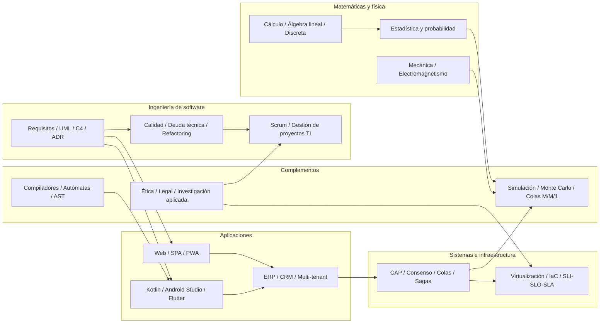
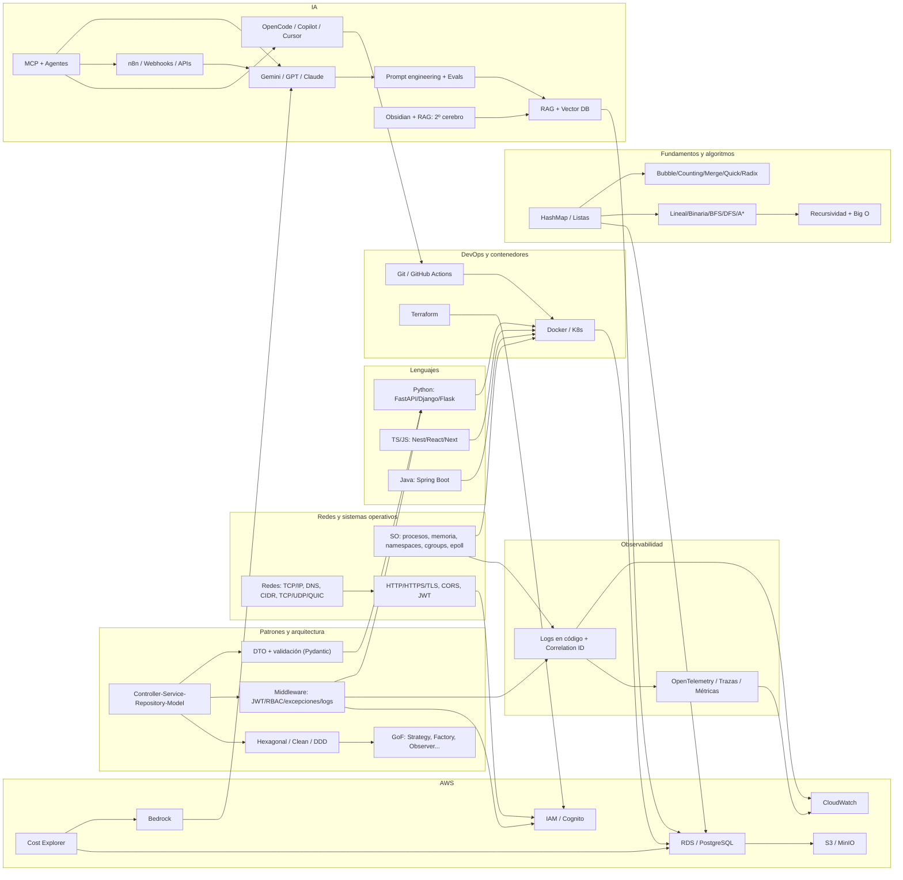
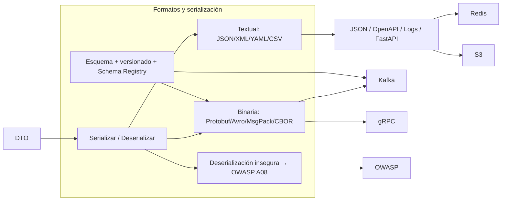

# Grafo del stack

Pega estos bloques en Obsidian con el plugin Mermaid activado (o usa la vista de grafo nativa).

## Grafo 1

```mermaid
flowchart LR
  subgraph MAT["Matemáticas y física"]
    CAL["Cálculo / Álgebra lineal / Discreta"]
    EST["Estadística y probabilidad"]
    FIS["Mecánica / Electromagnetismo"]
  end
  subgraph IS["Ingeniería de software"]
    REQ["Requisitos / UML / C4 / ADR"]
    CALID["Calidad / Deuda técnica / Refactoring"]
    GES["Scrum / Gestión de proyectos TI"]
  end
  subgraph APP["Aplicaciones"]
    WEB["Web / SPA / PWA"]
    MOV["Kotlin / Android Studio / Flutter"]
    EMP["ERP / CRM / Multi-tenant"]
  end
  subgraph SYS["Sistemas e infraestructura"]
    DIST["CAP / Consenso / Colas / Sagas"]
    INFRA["Virtualización / IaC / SLI-SLO-SLA"]
  end
  subgraph OTR["Complementos"]
    COMP["Compiladores / Autómatas / AST"]
    SIM["Simulación / Monte Carlo / Colas M/M/1"]
    ET["Ética / Legal / Investigación aplicada"]
  end
  CAL --> EST --> SIM
  FIS --> SIM
  REQ --> CALID --> GES
  REQ --> WEB
  REQ --> MOV
  WEB --> EMP
  MOV --> EMP
  EMP --> DIST --> INFRA
  DIST --> SIM
  COMP --> MOV
  ET --> GES
  ET --> INFRA
```

## Grafo 2

```mermaid
flowchart LR
  subgraph Pat["Patrones y arquitectura"]
    Capas["Controller-Service-Repository-Model"]
    DTO["DTO + validación (Pydantic)"]
    MW["Middleware: JWT/RBAC/excepciones/logs"]
    Hex["Hexagonal / Clean / DDD"]
    GoF["GoF: Strategy, Factory, Observer..."]
  end
  subgraph Alg["Fundamentos y algoritmos"]
    Hash["HashMap / Listas"]
    Sort["Bubble/Counting/Merge/Quick/Radix"]
    Search["Lineal/Binaria/BFS/DFS/A*"]
    Complexity["Recursividad + Big O"]
  end
  subgraph Leng["Lenguajes"]
    Py["Python: FastAPI/Django/Flask"]
    TS["TS/JS: Nest/React/Next"]
    Java["Java: Spring Boot"]
  end
  subgraph Ops["DevOps y contenedores"]
    Git["Git / GitHub Actions"]
    Docker["Docker / K8s"]
    TF["Terraform"]
  end
  subgraph Cloud["AWS"]
    IAM["IAM / Cognito"]
    RDS["RDS / PostgreSQL"]
    S3["S3 / MinIO"]
    CW["CloudWatch"]
    Bedrock["Bedrock"]
    Cost["Cost Explorer"]
  end
  subgraph Obs["Observabilidad"]
    Logs["Logs en código + Correlation ID"]
    OTel["OpenTelemetry / Trazas / Métricas"]
  end
  subgraph SIST["Redes y sistemas operativos"]
    RED["Redes: TCP/IP, DNS, CIDR, TCP/UDP/QUIC"]
    SO["SO: procesos, memoria, namespaces, cgroups, epoll"]
    HTTP["HTTP/HTTPS/TLS, CORS, JWT"]
  end
  subgraph IA["IA"]
    LLM["Gemini / GPT / Claude"]
    Prompt["Prompt engineering + Evals"]
    RAG["RAG + Vector DB"]
    MCP["MCP + Agentes"]
    Auto["n8n / Webhooks / APIs"]
    IDE["OpenCode / Copilot / Cursor"]
    ObsRAG["Obsidian + RAG: 2º cerebro"]
  end

  Capas --> DTO
  Capas --> MW
  Capas --> Hex
  Hex --> GoF
  DTO --> Py
  MW --> Py
  MW --> Logs
  MW --> IAM
  RED --> HTTP
  HTTP --> IAM
  SO --> Docker
  SO --> Logs
  Hash --> Sort
  Hash --> Search
  Search --> Complexity
  Hash --> RDS
  Py --> Docker
  TS --> Docker
  Java --> Docker
  Git --> Docker
  TF --> IAM
  Docker --> RDS
  RDS --> S3
  Logs --> CW
  Logs --> OTel
  OTel --> CW
  RAG --> RDS
  Prompt --> RAG
  LLM --> Prompt
  MCP --> LLM
  MCP --> Auto
  Auto --> LLM
  MCP --> IDE
  IDE --> Git
  ObsRAG --> RAG
  Bedrock --> LLM
  Cost --> Bedrock
  Cost --> RDS
```

## Grafo 3

```mermaid
flowchart LR
  subgraph FMT["Formatos y serialización"]
    Serz["Serializar / Deserializar"]
    Text["Textual: JSON/XML/YAML/CSV"]
    Bin["Binaria: Protobuf/Avro/MsgPack/CBOR"]
    Schema["Esquema + versionado + Schema Registry"]
    Insecure["Deserialización insegura → OWASP A08"]
  end
  DTO --> Serz
  Serz --> Text
  Serz --> Bin
  Serz --> Insecure
  Text --> JSON["JSON / OpenAPI / Logs / FastAPI"]
  Bin --> Kafka
  Bin --> GRPC["gRPC"]
  Schema --> Kafka
  Schema --> Bin
  JSON --> Redis
  JSON --> S3
  Insecure --> OWASP
```
